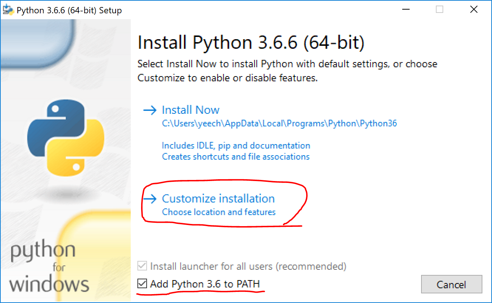
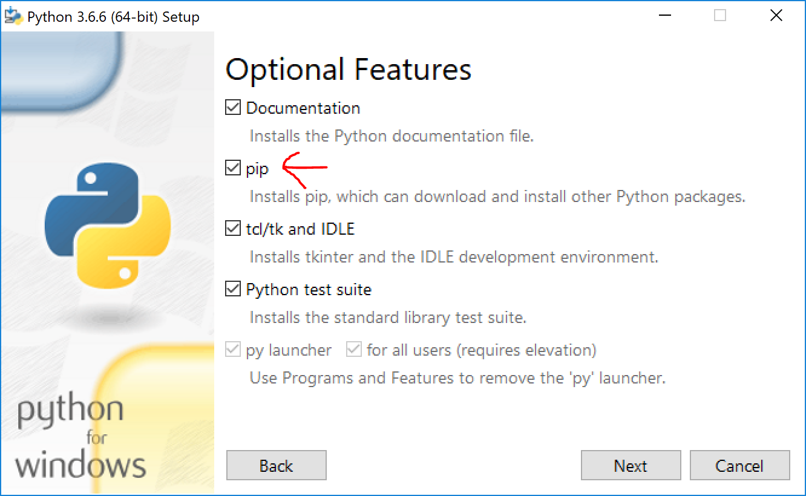

# Getting Ready for Flask workshop

## Installing Python

We'll be using python 3.6.6 for the workshop (but if you have python installed, just make sure it's python3).

First let's download the installer [here](https://www.python.org/downloads/release/python-366/) for your approporiate operating system (select the "executable installer" for Windows), then click "Customize Installation" with "Add Python 3.6 to PATH" checked.



After clicking next, make sure the boxes next to "pip" is clicked.



Then click through until installation finishes.

## Installing Flask

Open up the command line utility for your operating system (Command Prompt on Windows and Terminal on Macs), first verify that everything is correctly by typing
```
python
```
You should be greeted with something along the lines of
```
Python 3.6.6 (v3.6.6:4cf1f54eb7, Jun 27 2018, 03:37:03) [MSC v.1900 64 bit (AMD64)] on win32
Type "help", "copyright", "credits" or "license" for more information.
>>>
```
Type
```
>>> exit()
```
To get back to the command line.

Then to install flask, simply type
```
pip install flask
```
If you receive a permission error when running the above command try this (you will be prompted for your password)
```
sudo pip install flask
```

To verify that the installation worked, enter python again by typing `python`, then make sure that the following lines execute with no errors:
```
>>> import flask
```
```
>>> flask.__version__
'1.0.2'
```
