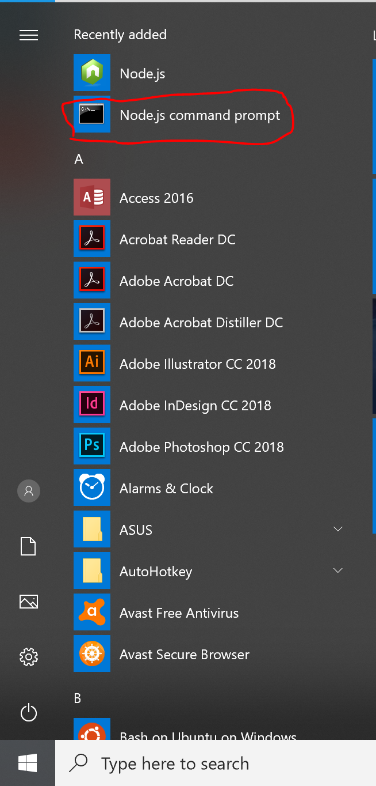

# Getting Ready for ReactNative

### Installing Node.js

If you already have Node.js and are familiar with the framework, feel free
to skip this part of the tutorial.

Otherwise, go to [https://nodejs.org/en/download/](https://nodejs.org/en/download/) and click the **Windows Installer (.msi)** if you are on Windows or **macOS Installer (.pkg)** link to download the installer.

Then use the installer to install on your machine.

### Installing ReactNative

We'll be roughly following the quickstart guide here [https://facebook.github.io/react-native/docs/getting-started](https://facebook.github.io/react-native/docs/getting-started), albeit with a bit more details.

**Windows**:
After installing Node.js, open the start menu, and search for "Node.js command prompt." This is what we will use for development.



Open the program, it should be a simple command prompt with the following line on top:

> Your environment has been set up for using Node.js 8.12.0 (x64) and npm.

**Mac**

Open spotlight and search for "Terminal"

**Installing ReactNative**

Once you have the command line utility open, type
```
npm install -g create-react-native-app
```

Enter `y` when prompted if you want to install the package globally.

To create a sample project (as you would do in the workshop) named 'SampleProject', run
```
create-react-native-app SampleProject
```

Choose 'blank' when prompted to choose a template.

When this finishes, run
```
cd SampleProject
```
and
```
expo start
```

Then install on your phone and see your (blank) project in action!!

### Installing Expo

On Android, find the "Expo" app (publishged by Expo Project with 4.1 star rating) and install that. Then use that to scan the QR code from your terminal to open your project on your phone!

On iOS, find the "Expo" app (published by Expo Project) and install that. Follow the on-screen instructions to get a link to the project you're working on. 
